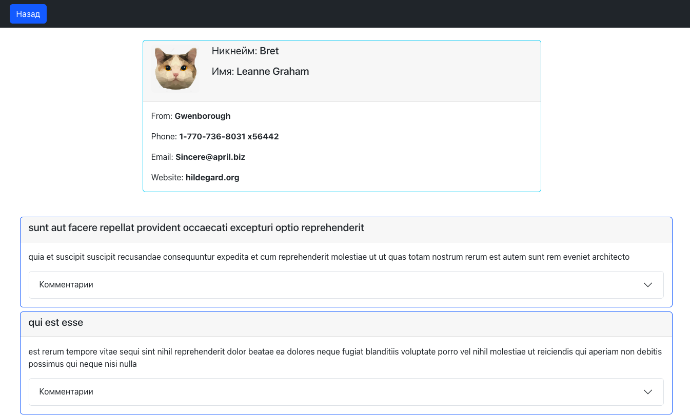

<h2>Интерфейс отображения постов</h2>
<h3>Инструкция для запуска проекта</h3>
<ol>
<li>Клонируйте репозиторий: <b>git clone</b> https://github.com/KrisPrymak/bootstrap-saga-ts.git</li>
<li>Перейдите на локальной машине в папку с проектом</li>
<li>Установите зависимости, используя <b>npm i</b></li>
<li>Запустите проект <b>npm start</b></li>
</ol>
<ul><li>Или перейдите к просмотру проекта на GitHub Pages https://krisprymak.github.io/bootstrap-saga-ts</li></ul>

<h3>В проекте используются:</h3>
<ul>
<li>TypeScript</li>
<li>React</li>
<li>React-bootstrap</li>
<li>React-router</li>
<li>Redux Toolkit</li>
<li>Redux-saga</li>
<li>Axios</li>
<li>Git</li>
</ul>
<h3>Описание проекта</h3>
<a target="_blank" href="https://drive.google.com/file/d/163DIA7r4JLUKS4-ylUabdJZNTy-EKFT8/view?usp=sharing">Видео презентация проекта</a>
  

<ul>
<li>Использовано фейковое api https://jsonplaceholder.typicode.com</li>
<li> Реализованы 3 страницы: 
    <ul>
        <li>Главная страница со списков постов</li>
        <li>Обо мне с краткой информацией</li>
        <li>Подробности о пользователе (инфа и список его постов)</li>
    </ul>
</li>
<li>В каждом посте (загруженного c сервера) есть аватар, при клике на который происходит переход на страницу пользователя</li>
<li>Комментарии изначально скрыты</li>
<li>Блок с комментариями открывается/закрывается при клике</li>
<li>Комментарии загружаются с сервера</li>
<li>При загрузке данных с сервера отображается лоадер</li>
<li>Сделана искусственная задержка в 0.5 секунд</li>
<li>Присутствует header с бургер меню и навигацией</li>
<li>На странице пользователя отображаются только его посты</li>
<li>На странице пользователя вместо бургер меню кнопка Назад, возвращающая на главную страницу со всеми постами</li>
<li>На странице пользователя данные подгужаются даже после обновления страницы</li>
</ul>
